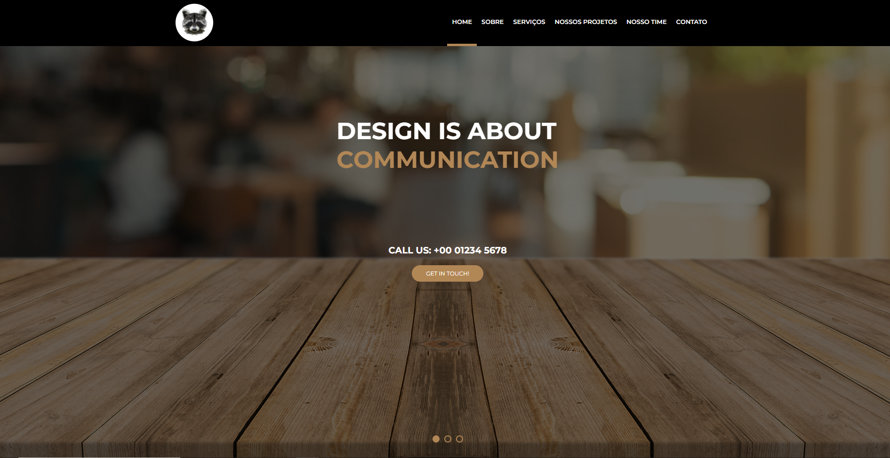
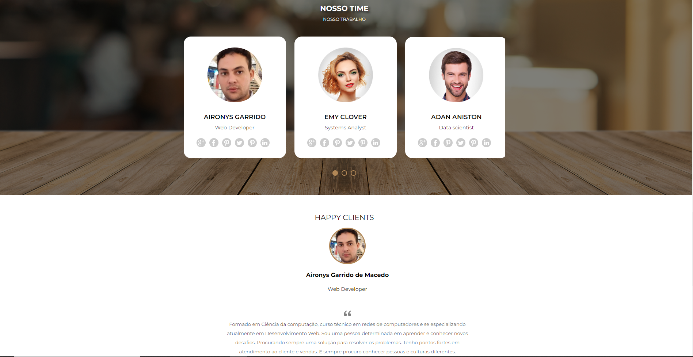
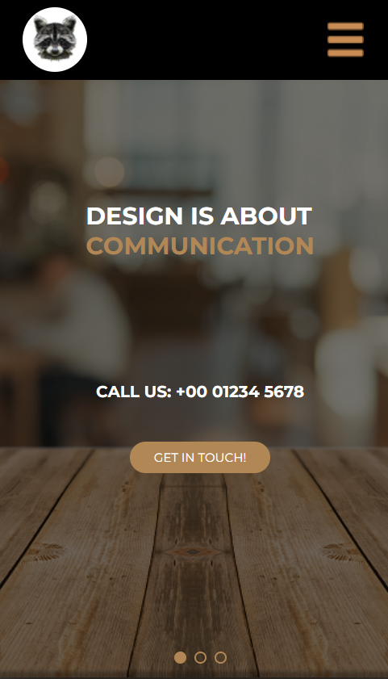

    <h3>Link do projeto:</h3>
    <a href="https://aironys-portfolio.netlify.app/" target="_blank">Ver projeto
        
Versão Descktop 

        
        
Versão Descktop 

        
    </a>
    <h3>Link do projeto:</h3>
<a href="https://aironys-portfolio.netlify.app/" target="_blank">Ver projeto
        
Mobile

        
       
</a>

<h3>PROJETO AWAX - 2.0 versão

Projeto desenvolvido no curso do PARÇAS DEVELOPERS

Site desenvolvido por Aironys Garrido

03/05/2022</h3>

